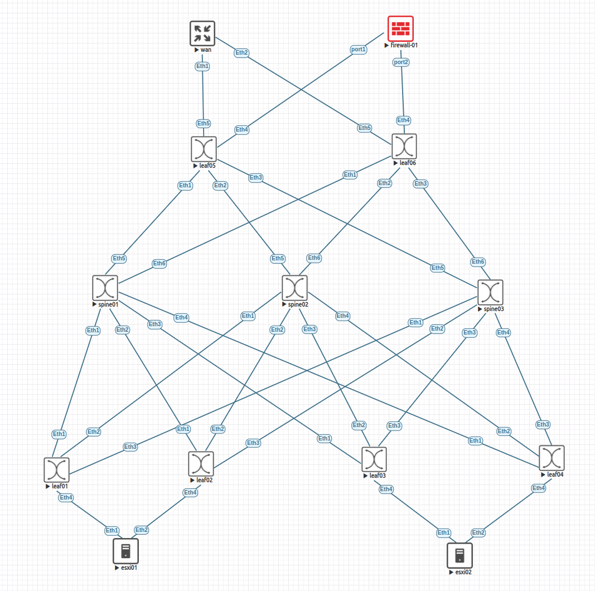

# IPv6 Data Center Fabric

---

Just a standard EVPN-VXLAN fabric with IPv6 only and using eBGP design where each Leaf is a different autonomous system and all Spines are in their own autonomous system. 

Two separate tenants and a firewall service insertion for traffic between tenants and WAN. Inter-VLAN communication is via Symmetric IRB.

---

Probably not the best allocation of IPv6 addresses, but I wanted something that would be easy to follow.